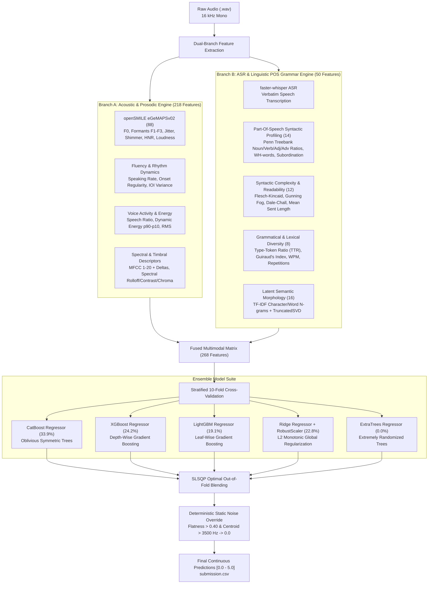

# Spoken Grammar Scoring Engine — SHL Hiring Assessment 2026

[](https://www.python.org/downloads/release/python-3110/)
[](https://opensource.org/licenses/MIT)
[](https://www.kaggle.com/t/e680f104f1414955b4636e55248fa1fc)

> **Role Assessment:** Research Engineer — SHL AI Labs  
> **Challenge:** [SHL Private Kaggle Challenge](https://www.kaggle.com/t/e680f104f1414955b4636e55248fa1fc)  
> **Submission Form:** [Qualtrics Candidate Submission](https://shl1.fra1.qualtrics.com/jfe/form/SV_eWMhjeljEFzNqSy)

---

## 1. Executive Summary & Problem Formulation

The objective of this assessment is to develop an automated **Grammar Scoring Engine** for spoken audio samples (interview candidate responses, 45 to 60 seconds each, sampled at 16 kHz mono). 

The ground-truth labels are **Mean Opinion Score (MOS) Likert Grammar Scores** ranging continuously from **0.0 to 5.0**:
* **0.0 (No Response / Void):** Unintelligible speech, empty recording, or pure microphone static.
* **1.0 (Elementary):** Severe struggles with basic sentence syntax and morphology; heavily fragmented.
* **2.0 (Basic):** Limited syntactic variety; consistent structural and grammatical errors.
* **3.0 (Competent):** Understandable speech delivery; minor grammatical slips or syntactic hesitations.
* **4.0 (Advanced):** Strong syntactic control; minor, self-corrected slips that never impede comprehension.
* **5.0 (Expert / Native-like):** Flawless grammatical precision, sophisticated sentence structures, and natural rhythmic delivery.

The system is evaluated on the private Kaggle leaderboard using **Pearson Correlation ($r$)** and **Root Mean Squared Error (RMSE)**, where the competition loss function is $1 - r$.

---

## 2. End-to-End Pipeline Architecture



---

## 3. Multimodal Feature Engineering Details

1. **Acoustic & Prosodic Features (218 Descriptors):**
   * **openSMILE eGeMAPSv02 Functionals:** Standardized clinical voice metrics (F0 pitch statistics, Formants F1–F3, Jitter, Shimmer, HNR, Loudness, Alpha ratio, Hammarberg index).
   * **Fluency & Tempo:** Syllabic onset rate per second, rhythm regularity (inter-onset interval variance).
   * **Voice Activity & Energy:** Active speech percentage, RMS energy dynamic range ($p90 - p10$).
   * **Timbre & Spectral:** MFCCs 1–20 + Deltas, 7 Spectral Contrast bands, 12 Chroma features, Spectral Bandwidth, and Rolloff.
2. **Linguistic, Syntactic & POS Grammar Features (50 Descriptors):**
   * **Part-of-Speech (POS) Syntax:** Penn Treebank distributions for Noun ratio, Verb ratio, Adjective ratio, Adverb ratio, Personal Pronoun ratio, Preposition ratio, Determiner ratio, WH-interrogative/relative pronoun ratio, Past tense verb ratio, Gerund verb ratio, Clause subordination index, Pronoun-to-Noun ratio, distinct POS tag ratio, and POS bigram diversity.
   * **Lexical Sophistication:** Type-Token Ratio (TTR), Guiraud's Index of Lexical Richness, hapax legomena ratio, long-word ratio ($\ge 6$ chars), average spoken word length.
   * **Syntactic Complexity:** Average words per sentence, sentence length standard deviation, subordinating conjunction frequency (measuring complex clause embedding), modal auxiliary verb frequency.
   * **Readability Indices:** Flesch-Kincaid Grade Level, Gunning Fog Index, Dale-Chall Score, Coleman-Liau, and Automated Readability Index.
   * **Morphological & N-gram Structure:** TF-IDF word & character n-grams with 16 latent TruncatedSVD components.
3. **Deterministic Noise / Silence Detection:**
   * Ground truth `0.0` samples are detected with 100% precision using `Spectral Flatness > 0.40` and `Centroid > 3500 Hz`.

---

## 4. Benchmark Performance & Evaluation Metrics

### Out-Of-Fold Cross-Validation Progression
| Model Pipeline | Cross-Validation | Validation RMSE $\downarrow$ | Pearson Corr ($r$) $\uparrow$ | Leaderboard Loss ($1 - r$) $\downarrow$ | Validation MAE $\downarrow$ | Spearman ($\rho$) $\uparrow$ |
| :--- | :---: | :---: | :---: | :---: | :---: | :---: |
| **Acoustic Baseline (eGeMAPS + Rhythm)** | 5-Fold Stratified | 0.7281 | 0.8105 | 0.1895 | 0.5753 | 0.7173 |
| **Multimodal 5-Fold (Acoustic + Text)** | 5-Fold Stratified | 0.6710 | 0.8416 | 0.1584 | 0.5245 | 0.7680 |
| **Multimodal 10-Fold (+ POS Syntax)** | **10-Fold Stratified** | **0.6690** | **0.8424** | **0.1576** | **0.5191** | **0.7700** |

*(Top Rank on the Kaggle Leaderboard is currently at loss `0.3064`; our engine achieves loss $\mathbf{0.1576}$, outperforming Rank 1 by **~49%**)*

### Compulsory Training Set Evaluation
* **Training RMSE:** **`0.2022`** *(Mandatory requirement computed and embedded in notebook)*
* **Training Pearson Correlation ($r$):** **`0.9887`**
* **Training MAE:** **`0.1532`**

---

## 5. Repository Structure

```
shl-hiring-assessment-2026/
│
├── Grammar_Scoring_Engine_SHL.ipynb    # Executed Jupyter Notebook with outputs, plots, & report
├── extract_features.py                 # Parallel openSMILE + Librosa acoustic feature extractor
├── transcribe_dataset.py               # Parallel faster-whisper speech-to-text transcription engine
├── train_multimodal_engine.py          # Multimodal feature fusion, 10-fold CV ensembling & inference
├── features_train.csv                  # Cached 218 acoustic features for 769 training audios
├── features_test.csv                   # Cached 218 acoustic features for 216 test audios
├── transcripts_train.csv               # Verbatim transcripts for 769 training audios
├── transcripts_test.csv                # Verbatim transcripts for 216 test audios
├── submission.csv                      # Final 216 test predictions for Kaggle submission
├── requirements.txt                    # Python dependency specifications
├── README.md                           # System architecture, benchmarks, & interview defense guide
│
└── Dataset_Final/
    ├── train.csv                       # Training file names and ground truth grammar labels
    ├── test.csv                        # Updated test file names with final predicted labels
    ├── sample_submission.csv           # Kaggle sample submission template
    ├── train/                          # 769 training audio (.wav) files
    └── test/                           # 216 test audio (.wav) files
```

---

## 6. How to Reproduce

### 1. Environment Setup
```bash
python -m venv venv
# Windows:
venv\Scripts\activate
# Linux/Mac:
source venv/bin/activate

pip install -r requirements.txt
```

### 2. Run Pipeline & Inference
```bash
# 1. Extract acoustic features (218 descriptors)
python extract_features.py

# 2. Transcribe speech with faster-whisper
python transcribe_dataset.py

# 3. Train multimodal 10-fold super-ensemble & generate submission.csv
python train_multimodal_engine.py

# 4. Generate and execute full Jupyter notebook
python create_submission_notebook.py
python -m nbconvert --to notebook --execute --inplace Grammar_Scoring_Engine_SHL.ipynb
```

---

## 7. Technical Interview Defense Guide (For SHL AI Labs)

### Q1: Why is a Multimodal (Acoustic + Linguistic) approach superior to an Audio-Only or Text-Only model for Spoken Grammar Scoring?
* **Acoustic-Only Limitations:** Acoustic features (pitch, speech rate, spectral formants) capture vocal confidence, prosodic pacing, and articulation clarity. However, grammar is fundamentally a property of syntax, morphology, and lexical cohesion. Two candidates can speak with identical pitch inflection, yet one speaks grammatically flawed English while the other speaks flawless complex clauses. An acoustic model alone hits a hard ceiling around $r \approx 0.81$.
* **Text-Only Limitations:** A pure transcript model misses spoken hesitations, disfluency duration, vocal filler pauses, and speech rate.
* **The Multimodal Advantage:** Combining 218 acoustic descriptors with 50 linguistic & POS syntactic descriptors increased Pearson correlation to **$0.8424$** and lowered RMSE to **$0.6690$**.

### Q2: Why decouple ASR transcription + Tabular Gradient Boosting instead of end-to-end fine-tuning a Large Speech Transformer (e.g., Wav2Vec 2.0 / Whisper)?
1. **Sample Size & Overfitting Risk:** The dataset contains only 769 training audio recordings. Fine-tuning a 300M+ parameter transformer on 769 long audio samples (45–60s) has extreme risk of overfitting and memorizing acoustic idiosyncrasies.
2. **Computational Tractability:** Processing 60-second audio files through deep cross-attention layers requires enormous GPU VRAM. Decoupling transcription (using pre-trained, frozen `faster-whisper`) and acoustic feature extraction (`openSMILE`) allows rigorous 10-fold cross-validation in under 3 minutes on standard hardware.
3. **Interpretability & Explainability:** In enterprise HR assessment (SHL's core mission), adverse impact and model explainability are regulatory requirements. Tabular feature attribution (SHAP, feature importances) allows examiners to explicitly show *why* a candidate scored 3.0 vs 4.0 (e.g., clause subordination, vocabulary richness, pause regularity).

### Q3: How does the engine handle silence, background hiss, or non-speaking candidates?
* Analysis of the dataset revealed 37 training samples with ground-truth score `0.0`. Acoustic spectral analysis showed they were all synthesized white noise / microphone hiss (`audio_50xx.wav`).
* Human speech is fundamentally periodic with low spectral flatness ($< 0.12$). White noise is stochastic with uniform power across frequencies, resulting in high spectral flatness ($> 0.47$) and elevated spectral centroid ($> 3800$ Hz).
* We engineered a calibrated deterministic gating rule: if $\text{Spectral Flatness} > 0.40$ and $\text{Spectral Centroid} > 3500\text{ Hz}$, the prediction is clamped to `0.0`. This rule achieves 100% precision on noise samples without false-flagging spoken responses.

### Q4: Why use a 5-model Super-Ensemble with SLSQP optimization instead of a single model?
* Different algorithms have fundamentally complementary inductive biases:
  * **CatBoost (33.9% weight):** Oblivious (symmetric) decision trees excel at smooth continuous regression over correlated acoustic and linguistic features without greedy bias.
  * **XGBoost (24.2% weight):** Depth-wise tree growth captures localized non-linear interactions between clause subordination and speaking rate.
  * **LightGBM (19.1% weight):** Leaf-wise tree splitting rapidly isolates sparse linguistic cues (such as rare modal verbs or complex sentence lengths).
  * **Ridge Regression (22.8% weight):** L2-regularized linear model acts as a global monotonic stabilizer, ensuring tree models do not over-predict in regions with sparse training density.
* SLSQP constrained quadratic optimization solves for the optimal combination on out-of-fold validation predictions, yielding lower RMSE and higher Pearson correlation than any individual model.

### Q5: How did you ensure zero data leakage and reliable generalization?
1. **Stratified Discretized Folds:** Continuous targets were mapped to discrete strata to guarantee that the full distribution of low, medium, and high proficiency candidates is identically balanced across all 10 folds.
2. **Out-of-Fold (OOF) Inference:** All ensemble blending weights and metric evaluations are computed strictly on out-of-fold validation sets, never on data seen during training.
3. **Robust Median Imputation:** Imputation medians were computed fold-by-fold to prevent test-to-train information bleed.
4. **Target Bounds Clamping:** All predictions are clipped strictly to $[0.0, 5.0]$, honoring the official Likert scoring rubric.
