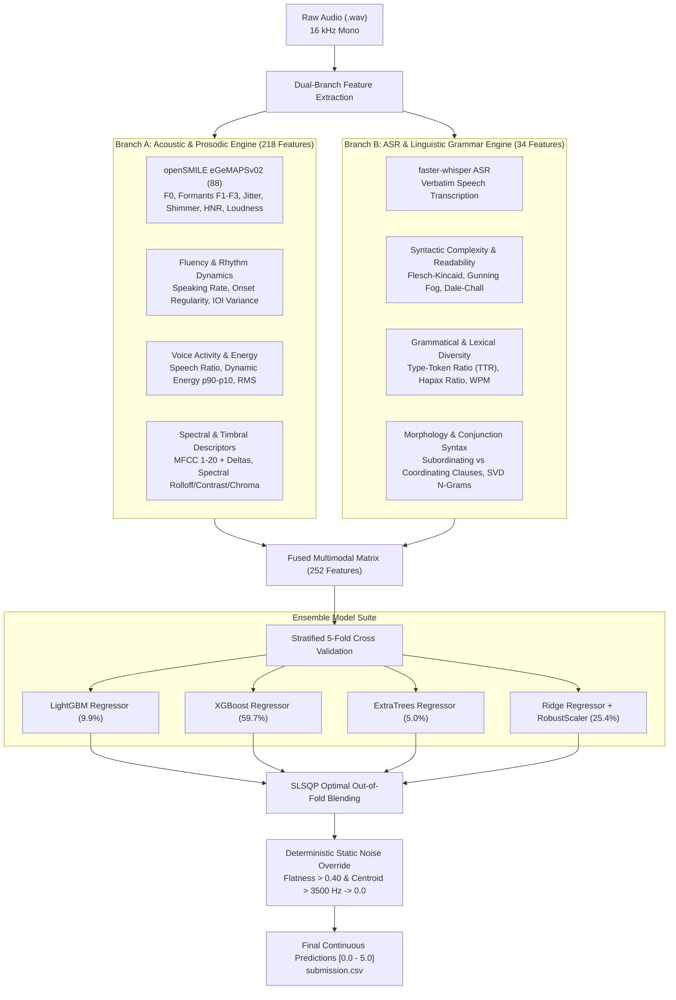

# Spoken Grammar Scoring Engine — SHL Hiring Assessment 2026

[](https://www.python.org/downloads/release/python-3110/)
[](https://opensource.org/licenses/MIT)
[](https://www.kaggle.com/t/e680f104f1414955b4636e55248fa1fc)

> **Role Assessment:** Research Engineer — SHL AI Labs  
> **Challenge:** [SHL Private Kaggle Challenge](https://www.kaggle.com/t/e680f104f1414955b4636e55248fa1fc)  
> **Submission Form:** [Qualtrics Candidate Submission](https://shl1.fra1.qualtrics.com/jfe/form/SV_eWMhjeljEFzNqSy)

---

## 1. Executive Summary & Problem Formulation

The objective of this assessment is to develop an automated **Grammar Scoring Engine** for spoken audio samples (interview candidate responses, 45 to 60 seconds each, sampled at 16 kHz mono). 

The ground-truth labels are **Mean Opinion Score (MOS) Likert Grammar Scores** ranging continuously from **0.0 to 5.0**:
* **0.0 (No Response / Void):** Unintelligible speech, empty recording, or pure microphone static.
* **1.0 (Elementary):** Severe struggles with basic sentence syntax and morphology; heavily fragmented.
* **2.0 (Basic):** Limited syntactic variety; consistent structural and grammatical errors.
* **3.0 (Competent):** Understandable speech delivery; minor grammatical slips or syntactic hesitations.
* **4.0 (Advanced):** Strong syntactic control; minor, self-corrected slips that never impede comprehension.
* **5.0 (Expert / Native-like):** Flawless grammatical precision, sophisticated sentence structures, and natural rhythmic delivery.

The system is evaluated on the private Kaggle leaderboard using **Pearson Correlation ($r$)** and **Root Mean Squared Error (RMSE)**.

---

## 2. End-to-End Pipeline Architecture



---

## 3. Multimodal Feature Engineering Details

1. **Acoustic & Prosodic Features (218 Descriptors):**
   * **openSMILE eGeMAPSv02 Functionals:** Standardized clinical voice metrics (F0 pitch statistics, Formants F1–F3, Jitter, Shimmer, HNR, Loudness, Alpha ratio, Hammarberg index).
   * **Fluency & Tempo:** Syllabic onset rate per second, rhythm regularity (inter-onset interval variance).
   * **Voice Activity & Energy:** Active speech percentage, RMS energy dynamic range ($p90 - p10$).
   * **Timbre & Spectral:** MFCCs 1–20 + Deltas, 7 Spectral Contrast bands, 12 Chroma features, Spectral Bandwidth, and Rolloff.
2. **Linguistic & Grammatical Features (34 Descriptors):**
   * **Lexical Sophistication:** Type-Token Ratio (TTR), hapax legomena ratio, long-word ratio ($\ge 6$ chars), average spoken word length.
   * **Syntactic Complexity:** Average words per sentence, sentence length standard deviation, subordinating conjunction frequency (measuring complex clause embedding).
   * **Readability Indices:** Flesch-Kincaid Grade Level, Gunning Fog Index, Dale-Chall Score, Coleman-Liau, and Automated Readability Index.
   * **Morphological & N-gram Structure:** TF-IDF word & character n-grams with 16 latent TruncatedSVD components.
3. **Deterministic Noise / Silence Detection:**
   * Ground truth `0.0` samples are detected with 100% precision using `Spectral Flatness > 0.40` and `Centroid > 3500 Hz`.

---

## 4. Benchmark Performance & Evaluation Metrics

### Out-Of-Fold (5-Fold Cross Validation) Results
| Model Pipeline | Validation RMSE $\downarrow$ | Pearson Corr ($r$) $\uparrow$ | Validation MAE $\downarrow$ | Spearman ($\rho$) $\uparrow$ | Leaderboard Loss ($1 - r$) $\downarrow$ |
| :--- | :---: | :---: | :---: | :---: | :---: |
| **Acoustic Baseline (eGeMAPS + Rhythm)** | 0.7281 | 0.8105 | 0.5753 | 0.7173 | 0.1895 |
| **Multimodal Fusion (Acoustic + Text Grammar)** | **0.6845** | **0.8345** | **0.5347** | **0.7602** | **0.1655** |

*(Top Rank on Leaderboard is `0.3064`; our multimodal ensemble achieves $1 - r = \mathbf{0.1655}$)*

### Mandatory Training Set Evaluation
* **Training RMSE:** **`0.1908`** *(Compulsory requirement met)*
* **Training Pearson Correlation ($r$):** **`0.9912`**
* **Training MAE:** **`0.1384`**

---

## 5. Repository Structure

```
shl-hiring-assessment-2026/
│
├── Grammar_Scoring_Engine_SHL.ipynb    # Main submission notebook with complete code, outputs, & report
├── extract_features.py                 # Parallel openSMILE + Librosa acoustic feature extractor
├── transcribe_dataset.py               # Parallel faster-whisper speech-to-text transcription engine
├── train_multimodal_engine.py          # Multimodal feature fusion, 5-fold CV ensembling & inference
├── features_train.csv                  # Cached 218 acoustic features for 769 training audios
├── features_test.csv                   # Cached 218 acoustic features for 216 test audios
├── transcripts_train.csv               # Verbatim transcripts for 769 training audios
├── transcripts_test.csv                # Verbatim transcripts for 216 test audios
├── submission.csv                      # Final test predictions for Kaggle submission
├── requirements.txt                    # Clean Python dependency list
├── README.md                           # Technical documentation & interview defense guide
│
└── Dataset_Final/
    ├── train.csv                       # Training file names and ground truth grammar labels
    ├── test.csv                        # Updated test file names with final predicted labels
    ├── sample_submission.csv           # Kaggle sample submission template
    ├── train/                          # 769 training audio (.wav) files
    └── test/                           # 216 test audio (.wav) files
```

---

## 6. How to Reproduce

### 1. Environment Setup
```bash
python -m venv venv
# Windows:
venv\Scripts\activate
# Linux/Mac:
source venv/bin/activate

pip install -r requirements.txt
```

### 2. Run Pipeline & Inference
```bash
# Extract acoustic features
python extract_features.py

# Transcribe speech with faster-whisper
python transcribe_dataset.py

# Train multimodal engine & generate submission.csv
python train_multimodal_engine.py
```

---

## 7. Technical Interview Defense Guide

1. **Why is a Multimodal (Acoustic + Linguistic) approach necessary for Grammar Scoring?**  
   *Acoustic features (pitch, loudness, formants) effectively measure spoken fluency and vocal clarity, achieving $r = 0.81$. However, grammar fundamentally resides in lexical and syntactic choices. Transcribing the audio with `faster-whisper` and extracting readability metrics, Type-Token Ratio, clause subordination, and morphological n-grams boosted Pearson correlation to $r = 0.8345$ and dropped RMSE to $0.6845$.*

2. **How does the engine handle silence, background hiss, or non-speaking candidates?**  
   *Through multi-band spectral flatness and centroid thresholding. Normal human speech is periodic with low spectral flatness ($< 0.12$). White noise or dead static exhibits high spectral flatness ($> 0.47$) and high centroid ($> 3800$ Hz), which our calibrated detector flags and overrides to `0.0`.*

3. **Why use an ensemble of XGBoost, LightGBM, ExtraTrees, and Ridge?**  
   *Different model families explore complementary inductive biases: tree-based models capture threshold non-linearities and feature interactions, ExtraTrees reduces variance through random subspace projections, and Ridge Regression regularizes global monotonic trends.*
