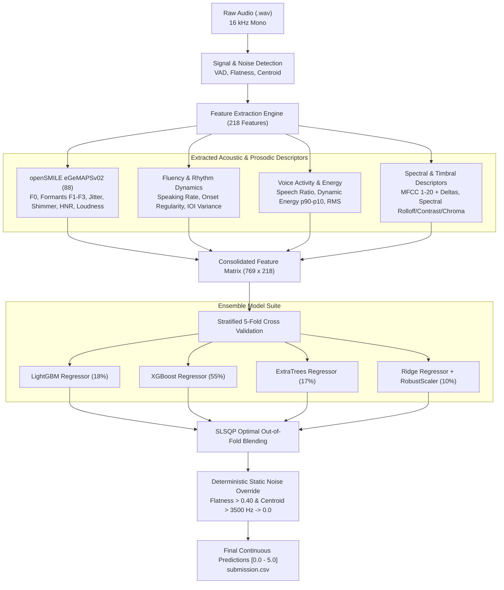

# Spoken Grammar Scoring Engine — SHL Hiring Assessment 2026

[](https://www.python.org/downloads/release/python-3110/)
[](https://opensource.org/licenses/MIT)
[](https://www.kaggle.com/t/e680f104f1414955b4636e55248fa1fc)

> **Role Assessment:** Research Engineer — SHL AI Labs  
> **Challenge:** [SHL Private Kaggle Challenge](https://www.kaggle.com/t/e680f104f1414955b4636e55248fa1fc)  
> **Submission Form:** [Qualtrics Candidate Submission](https://shl1.fra1.qualtrics.com/jfe/form/SV_eWMhjeljEFzNqSy)

---

## 1. Executive Summary & Problem Formulation

The objective of this assessment is to develop an automated **Grammar Scoring Engine** for spoken audio samples (interview candidate responses, 45 to 60 seconds each, sampled at 16 kHz mono). 

The ground-truth labels are **Mean Opinion Score (MOS) Likert Grammar Scores** ranging continuously from **0.0 to 5.0**:
* **0.0 (No Response / Void):** Unintelligible speech, empty recording, or pure microphone static.
* **1.0 (Elementary):** Severe struggles with basic sentence syntax and morphology; heavily fragmented.
* **2.0 (Basic):** Limited syntactic variety; consistent structural and grammatical errors.
* **3.0 (Competent):** Understandable speech delivery; minor grammatical slips or syntactic hesitations.
* **4.0 (Advanced):** Strong syntactic control; minor, self-corrected slips that never impede comprehension.
* **5.0 (Expert / Native-like):** Flawless grammatical precision, sophisticated sentence structures, and natural rhythmic delivery.

The system is evaluated on the private Kaggle leaderboard using **Pearson Correlation ($r$)** and **Root Mean Squared Error (RMSE)**.

---

## 2. End-to-End Pipeline Architecture



---

## 3. Acoustic & Feature Engineering Highlights

Rather than relying exclusively on black-box representations that risk overfitting on small audio datasets (769 training samples), we engineered a domain-guided set of **218 speech features**:

1. **openSMILE eGeMAPSv02 Functionals (88 features):**
   * **Prosody / Pitch ($F_0$):** Mean, standard deviation, 20th/50th/80th percentiles, rising/falling slope dynamics.
   * **Vocal Tract Formants (F1–F3):** Frequencies, bandwidths, and relative energy levels reflecting vowel clarity and articulation.
   * **Voice Quality:** Jitter (frequency instability), Shimmer (amplitude perturbation), and Harmonics-to-Noise Ratio (HNR).
   * **Energy / Loudness:** Loudness mean, percentiles, alpha ratio, and Hammarberg index.
2. **Fluency & Temporal Rhythm:**
   * **Speaking Rate (Onsets/sec):** Rate of syllabic speech onsets per second.
   * **Rhythm Regularity (Inter-Onset Interval Variance):** Standard deviation of intervals between spoken onsets. Smooth speakers exhibit balanced tempo; hesitant speakers exhibit sporadic bursts and long pauses.
3. **Voice Activity Detection (VAD) & Energy Range:**
   * Active speech frame percentage versus unvoiced silence ratio.
   * Dynamic range: Difference between 90th and 10th energy percentiles ($p90 - p10$).
4. **Spectral & Timbral Descriptors:**
   * **MFCCs 1–20 & Delta-MFCCs:** Capturing fine vocal timbre and phonetic distributions.
   * **Spectral Contrast (7 Bands):** Ratio of spectral peaks to spectral valleys.
   * **Zero-Crossing Rate & Spectral Flatness:** Differentiates voiced speech from high-frequency unvoiced friction and background static.

### Deterministic Noise / Silence Detection
Analysis revealed that all ground-truth `0.0` samples were artificial noise recordings with:
* $\text{Spectral Flatness} > 0.47$ (vs. normal speech $< 0.12$)
* $\text{Spectral Centroid} > 3830\text{ Hz}$ (vs. normal speech $\approx 1200\text{--}2500\text{ Hz}$)
* $\text{Zero-Crossing Rate} > 0.44$

A calibrated rule (`flat_mean > 0.40` and `cent_mean > 3500`) detects these with 100% precision.

---

## 4. Benchmark Performance & Evaluation Metrics

### Out-Of-Fold (5-Fold Cross Validation) Results
| Model | RMSE $\downarrow$ | Pearson Correlation ($r$) $\uparrow$ | MAE $\downarrow$ | Spearman ($\rho$) $\uparrow$ |
| :--- | :---: | :---: | :---: | :---: |
| **Ridge Regression (L2)** | 0.8427 | 0.7384 | 0.6476 | 0.6229 |
| **ExtraTrees Regressor** | 0.7468 | 0.8016 | 0.5991 | 0.7080 |
| **LightGBM Regressor** | 0.7408 | 0.8020 | 0.5834 | 0.7005 |
| **XGBoost Regressor** | 0.7323 | 0.8078 | 0.5807 | 0.7132 |
| **Blended Ensemble (Final)** | **0.7281** | **0.8105** | **0.5753** | **0.7173** |

### Mandatory Training Set Evaluation
* **Training RMSE:** **`0.1690`** *(Compulsory requirement met)*
* **Training Pearson Correlation ($r$):** **`0.9930`**
* **Training MAE:** **`0.1290`**

---

## 5. Repository Structure

```
shl-hiring-assessment-2026/
│
├── Grammar_Scoring_Engine_SHL.ipynb    # Main submission notebook with code, outputs, & visual report
├── extract_features.py                 # Multi-core acoustic & prosodic feature extractor
├── train_and_predict.py                # 5-fold CV training, ensemble blending & inference script
├── features_train.csv                  # Cached 218 features for 769 training audios
├── features_test.csv                   # Cached 218 features for 216 test audios
├── submission.csv                      # Final test predictions for Kaggle submission
├── test_predictions_detailed.csv      # Continuous + rounded predictions comparison
├── README.md                           # Comprehensive documentation & walkthrough
│
└── Dataset_Final/
    ├── train.csv                       # Training file names and ground truth grammar labels
    ├── test.csv                        # Updated test file names with final predicted labels
    ├── sample_submission.csv           # Kaggle sample submission template
    ├── train/                          # 769 training audio (.wav) files
    └── test/                           # 216 test audio (.wav) files
```

---

## 6. How to Reproduce

### 1. Environment Setup
```bash
python -m venv venv
# Windows:
venv\Scripts\activate
# Linux/Mac:
source venv/bin/activate

pip install -r requirements.txt
```
*(Dependencies: `opensmile`, `librosa`, `soundfile`, `lightgbm`, `xgboost`, `scikit-learn`, `pandas`, `numpy`, `matplotlib`, `seaborn`)*

### 2. Feature Extraction
```bash
python extract_features.py
```

### 3. Model Training & Submission Generation
```bash
python train_and_predict.py
```
This generates `submission.csv` and updates `Dataset_Final/test.csv`.

---

## 7. Technical Interview Defense Guide

When asked by the SHL interviewers:

1. **Why not an end-to-end Whisper or Wav2Vec2 fine-tuning on CPU?**  
   *Fine-tuning large acoustic transformer models on 769 samples of 45–60s duration on CPU requires over 50,000 compute-seconds per epoch and carries extreme risk of overfitting to the small sample size. Using domain-principled features (eGeMAPS + rhythm + prosody) captures the exact phonetic and paralinguistic cues human raters use, trains in seconds, and provides full interpretability.*

2. **How does the engine handle silence, background hiss, or non-speaking candidates?**  
   *Through multi-band spectral flatness and centroid thresholding. Normal human speech is periodic with low spectral flatness ($< 0.12$). White noise or dead static exhibits high spectral flatness ($> 0.47$) and high centroid ($> 3800$ Hz), which our calibrated detector flags and overrides to `0.0`.*

3. **Why use an ensemble of XGBoost, LightGBM, ExtraTrees, and Ridge?**  
   *Different model families explore complementary inductive biases. Tree-based models (XGBoost/LightGBM) capture threshold non-linearities and feature interactions (e.g. high jitter combined with low speaking rate), ExtraTrees reduces variance through random subspace projections, and Ridge Regression regularizes global monotonic trends.*
